# Tap That Mosquito - System Flow

Complete technical flow documentation for the Tap That Mosquito game, including all user journeys, smart contracts, and on-chain interactions.

---

## System Architecture


---

## User Entry Flow


---

## Solo Game Flow


---

## Versus Mode Flow

```mermaid
flowchart TD
    Start([Open Versus Mode]) --> Options{Action}
    
    Options --> CreateChallenge[Create Challenge]
    Options --> ViewPending[View Pending Challenges]
    
    subgraph Create["Create Challenge"]
        CreateChallenge --> EnterOpponent[Enter @username or FID]
        EnterOpponent --> LookupUser[Lookup via Neynar API]
        LookupUser --> GetAddress[Get Wallet Address]
        GetAddress --> CallContract[POST /api/challenge?action=create]
        CallContract --> WaitAccept[Wait for Accept]
        WaitAccept --> Notify[Send Notification via Farcaster]
    end
    
    subgraph Accept["Accept Challenge"]
        ViewPending --> SelectChallenge[Select Challenge]
        SelectChallenge --> AcceptBtn[Click Accept]
        AcceptBtn --> CallAccept[POST /api/challenge?action=accept]
        CallAccept --> BothPlay[Both Players Play Game]
    end
    
    BothPlay --> SubmitScores[POST /api/challenge?action=submit]
    SubmitScores --> RecordResult[Backend Records Winner + Notifies]
    RecordResult --> DetermineWinner{Who Won?}
    
    DetermineWinner -->|Winner| ShowVictory[Victory Screen]
    DetermineWinner -->|Loser| ShowDefeat[Defeat Screen]
    
    ShowVictory --> CanMint[Mint Victory NFT (demo)]
    ShowVictory --> CheckStreak{5+ Total Wins?}
    CheckStreak -->|Yes| ChampionNFT[Champion NFT (future)]
```

---

## GamePass P2W Flow

```mermaid
flowchart TD
    Start([GamePass Section]) --> CheckPass{Has GamePass?}
    
    CheckPass -->|No| ShowMint[Show Mint Button]
    ShowMint --> ClickMint[User Clicks Mint]
    ClickMint --> ResolveRef[Resolve referrer (?ref username or 0x)]
    ResolveRef --> Pay["Pay 0.0005 ETH"]
    Pay --> Contract[GamePassNFT.mintGamePass]
    
    subgraph Revenue["Revenue Split"]
        Contract --> Split[Split Payment]
        Split --> Prize["70% → Prize Pool"]
        Split --> Treasury["20% → Treasury"]
        Split --> Referral["10% → Referrer (must hold GamePass) or Treasury"]
    end
    
    Contract --> MintNFT[Mint ERC-721 Token]
    MintNFT --> UpdateUI[Update UI: Pass Owned]
    
    CheckPass -->|Yes| ShowEligible[Show Prize Eligible Badge]
    ShowEligible --> ViewPool[View Prize Pool Balance]
    
    subgraph Weekly["Weekly Distribution"]
        WeekEnd([Week Ends]) --> Backend[Backend Calculates Top 10]
        Backend --> SignDistribution[Sign Distribution]
        SignDistribution --> CallDistribute[distributeWeeklyPrize]
        CallDistribute --> PayWinners[Pay ETH to Winners]
        PayWinners --> RollOver[Unpaid → Next Week Pool]
    end
```

---

## Achievement NFT Minting Flow


---

## Sponsor Flow

```mermaid
flowchart TD
    Start([Click Become Sponsor]) --> ShowTiers[Show Tier Options]
    
    ShowTiers --> Bronze["🥉 Bronze $3"]
    ShowTiers --> Silver["🥈 Silver $5"]
    ShowTiers --> Gold["🥇 Gold $10"]
    ShowTiers --> Diamond["💎 Diamond $20"]
    
    Bronze & Silver & Gold & Diamond --> SelectTier[User Selects Tier]
    SelectTier --> ApproveUSDC[Approve USDC Spend]
    ApproveUSDC --> Deposit[PrizePool.deposit]
    Deposit --> TrackSponsor[Track in Contract]
    
    TrackSponsor --> UpdateWall[Update Sponsor Wall]
    
    subgraph Perks["Sponsor Perks"]
        Silver --> Boost["Permanent Game Boosts"]
        Gold --> SponsorNFT["Mint Sponsor NFT"]
        Diamond --> Featured["Featured in Casts"]
    end
    
    subgraph Distribution["Weekly Distribution"]
        Pool[Prize Pool] --> Calculate["100% Distribute (reserve 0%)"]
        Calculate --> Top10[Pay Top 10 Players]
    end
```



---

## Referral System Flow


---

## Smart Contract Summary

| Contract | Purpose | Key Functions |
|----------|---------|---------------|
| **MosquitoSlayerNFT** | Achievement NFTs | `mintAchievement`, `getClaimableTiers` |
| **VersusNFT** | 1v1 Battles | `createChallenge`, `acceptChallenge`, `finalizeBattle`, `mintVictoryNFT` |
| **PrizePool** | Sponsor Rewards (USDC) | `deposit`, `distribute`, `mintSponsorNFT` |
| **GamePassNFT** | P2W Entry (ETH) | `mintGamePass`, `mintWithReferral`, `distributeWeeklyPrize` |

---

## Security Model


All score-based actions require backend signature verification to prevent cheating.

---

## Environment Variables

```bash
# Contracts
VITE_NFT_CONTRACT_ADDRESS=0x...      # MosquitoSlayerNFT
VITE_VERSUS_CONTRACT_ADDRESS=0x...   # VersusNFT
VITE_PRIZE_POOL_ADDRESS=0x...        # PrizePool
VITE_GAMEPASS_CONTRACT_ADDRESS=0x... # GamePassNFT

# Backend Signing
SIGNER_PRIVATE_KEY=0x...
SIGNER_ADDRESS=0x...

# External Services
NEYNAR_API_KEY=...
VITE_SUPABASE_URL=...
VITE_SUPABASE_ANON_KEY=...
```

---

## Deployment Checklist

- [ ] Deploy GamePassNFT to Base Sepolia
- [ ] Test mint flow with testnet ETH
- [ ] Verify contract on BaseScan
- [ ] Deploy to Base Mainnet
- [ ] Update `.env` with mainnet address
- [ ] Test full flow in production
- [ ] Create weekly distribution cron job
